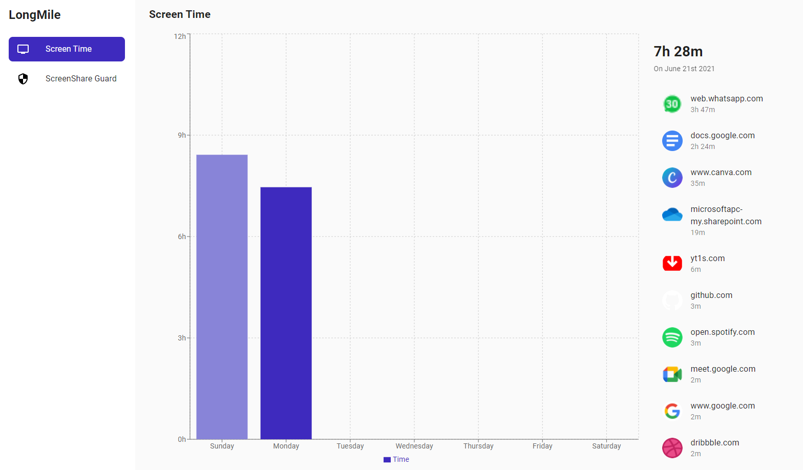
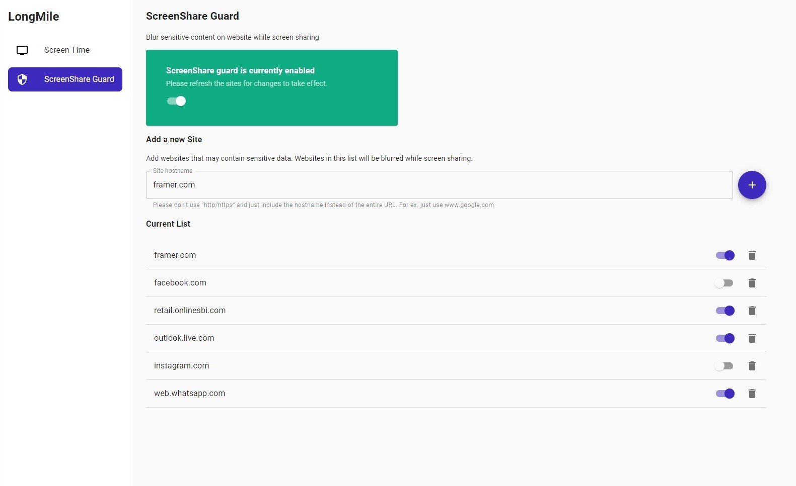

# LongMile

All in one productivity suite. Use LongMile to skyrocket your productivity and take control of your life.

This repository contains the code for the LongMile companion extension. The extension is supported on all Chromium based browsers like Edge, Chrome, Brave etc. 

It provides two main features.

#### Screen Time
The extension tracks your weekly screen time on websites with a graphical representation. You can track the amount of time spent on each website. This way, you get to know on which website you spend the most amount of your time.

#### ScreenShare Guard
There can be a lot of sensitive information on your browser tabs, so while sharing your screen, there is a risk of compromising this information. ScreenShare Guard is a feature of the LongMile companion extension which blurs sensitive content on websites so that no sensitive information is shared while screen-sharing.

### Run the extension

To run the extension, you need to have Node.js and NPM installed.
First run the command `npm install` to install the dependencies

To build the JavaScript bundles, run `npm run build`. 
Alternatively, you can run `npm start` to run the development version. The development version supports **HMR**(Hot-Module Replacement).

Both the commands will generate the JavaScript bundles to the `/build` folder

Open your chromium based browser(Edge, Chrome, Brave etc), go to your extension options and enable Developer mode. 
Then click on the **Load unpacked** option and select the `/build` folder. 
Now, the extension will be installed in Developer mode.

This chrome extension was bootstrapped from the boilerplate project [lxieyang/chrome-extension-boilerplate-react.](https://github.com/lxieyang/chrome-extension-boilerplate-react) Do check it out!
